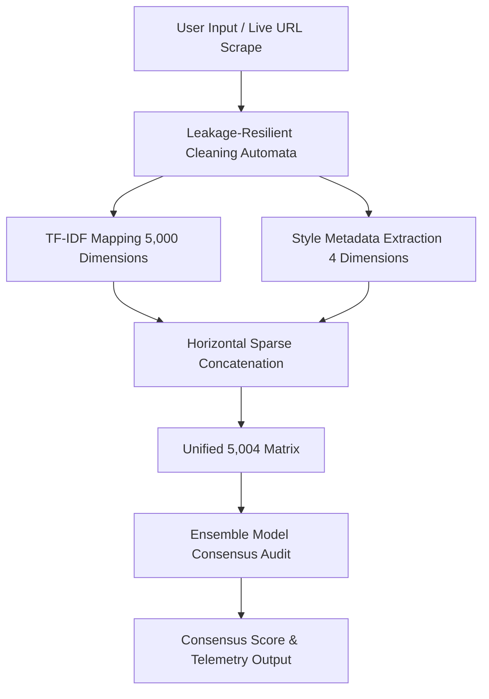

# 🛡️ VerifIQ: Real-Time Decoupled Information Flow & Fake News Detection Platform

VerifIQ is a real-time, global textual integrity auditing framework designed to verify information flow, trace vocabulary propagation, and classify news articles with academic rigor and active machine learning telemetry.

---

## 🚀 1. Executive Summary & Core Mission

Modern digital landscapes suffer from information asymmetry, where fabricated clickbait spreads faster than verified journalism. Traditional natural language processing models fail here because they rely on batch offline training (which becomes obsolete instantly) or pick up shallow contextual artifacts (feature leakage) like publisher names.

**VerifIQ** solves this by establishing a decoupled, leakage-resilient, and continuously evolving detection framework. Its core mission is to provide an unbiased, real-time auditing system that parses custom text inputs or live URL scrapes, processes them through a custom regex-based cleaning engine, maps them to a hybrid 5,004-dimensional sparse-dense feature space, and outputs a consensus verification score. 

By running on a combination of lightweight serverless-friendly static frontends (GitHub Pages) and live interactive machine learning models with active feedback loops, VerifIQ represents the future of adaptive, high-integrity content verification.

---

## 🛠️ 2. The Modern Tech Stack & Architectural Purpose

Every layer of VerifIQ has been chosen to optimize performance, minimize latency, and run efficiently on both desktop and mobile devices.

| Tech Component | Type / Layer | Exact Functional Value & Purpose |
| :--- | :--- | :--- |
| **Python** | Foundation | Backs the core scientific pipelines, custom regex automata, data orchestration, and mathematical feature modeling. |
| **Streamlit** | Portal UI | Houses the interactive, dark-themed diagnostic dashboard, styled via custom CSS overrides to form a premium glassmorphic interface. |
| **HTML5 Canvas / CSS3 / JS** | Simulator Frontend | Provides a fully responsive, mobile-optimized simulation representing news propagation, high-DPI scaling, and multi-touch interactions. |
| **Scikit-Learn (SGDClassifier)** | Online Learning | The streaming machine learning brain; trained with a log-loss objective function to dynamically perform probability estimations and online active updates. |
| **Scikit-Learn (TfidfVectorizer)** | Text Vectorizer | Maps tokenized streams into 5,000 spatial vocabulary columns, measuring weight variations using TF-IDF. |
| **BeautifulSoup4 & Requests** | Web Crawler | Powers the live URL parsing pipeline, executing asynchronous page scraping across any target domain. |
| **SciPy (Sparse Modules)** | Matrix Operations | Horizontally concatenates mismatched matrices (5,000-dim sparse TF-IDF vectors + 4-dim dense metadata arrays) without memory exhaustion. |

---

## 🔄 3. Step-by-Step Runtime Project Flow



### 1. Ingestion Layer
The user provides text using two input pathways:
* **Manual Ingestion:** Raw article text pasted directly into the dark-themed input text area.
* **Crawler Ingestion:** A target URL is entered; the background crawler using `Requests` fetches the HTML pages, and `BeautifulSoup4` extracts content from `<article>`, `<p>`, and header tags.

### 2. Leakage-Resilient Cleaning Automata
High-level NLP libraries (like NLTK or SpaCy wrappers) are skipped. Instead, a custom preprocessing pipeline constructed from core regular expressions executes:
* Stripping out publisher Dateline stamps (e.g. `WASHINGTON (Reuters) - ...`, `LONDON (AP)`) which bias models towards labeling articles as "Real" based solely on publisher name.
* Sanitizing hyperlinked footer tags and social attribution stamps (e.g., *"read more via..."*) to prevent the model from exploiting social source markers (a major source of feature leakage).

### 3. Hybrid Feature Layer Engineering
The sanitized string is converted into a dual-feature system:
* **Sparse Vector:** A 5,000-dimensional spatial map generated by the fitted TF-IDF Vectorizer.
* **Dense Metadata Metrics:** Extracts 4 key stylistic indicators:
  1. **Clickbait Capitalization Ratio:** Percentage of uppercase letters relative to character count.
  2. **Punctuation Density:** Count of extreme punctuation (`!` and `?`) relative to document length.
  3. **Average Word Length:** Tracks vocabulary complexity.
  4. **Sentiment Intensity Bias:** Tracks emotional weight based on local keyword indicators.

### 4. The 5,004 Matrix Transformation
The 5,000-dimensional sparse vocabulary matrix and the 4-dimensional dense metadata array are merged horizontally using `scipy.sparse.hstack`:
$$\text{Input Vector} = [\text{Sparse TF-IDF}_{5000} \;\Vert\; \text{Dense Style Metadata}_{4}]$$
This guarantees a unified, memory-efficient feature block of exactly **5,004 parameters** for model inference.

### 5. Ensemble Assessment & Consensus
The unified matrix is fed into our ensemble model core (consisting of Logistic Regression, Random Forest, Multi-Layer Perceptrons, and K-Nearest Neighbors). These models run calculations in parallel, outputs individual probability values, and yields a balanced mathematical consensus.

### 6. Consumer Telemetry Output
The dashboard renders a beautiful, responsive horizontal percentage distribution bar along with system telemetry details, such as feature density charts, classification metrics, and live fact-checking summaries.

---

## 🧠 4. Incremental Online Active Learning Methodology

Traditional Machine Learning pipelines suffer from **Model Drift**—as news topics shift over time, static models trained months ago lose accuracy. Re-training traditional models requires **Batch Learning**, where the developer must rebuild the entire pipeline from scratch, passing the entire historical dataset back through vectorization and model fitting. This is slow, expensive, and impractical for real-time applications.

### The Online Learning Solution
VerifIQ solves this using **Incremental Online Learning** backed by scikit-learn's `SGDClassifier` and `partial_fit` API:
* **Live Adaptability:** When a user flags a classification error or provides correct label feedback, VerifIQ does not rebuild itself.
* **Gradient Adjustments:** The model computes loss gradient adjustments solely on the new input, updating its stored weights file directly on disk (`models/sgd_online_model.pkl`).
* **Active Feedback Loop:** This feedback loop allows the model to learn new misinformation signatures and vocabulary shifts on-the-fly, mimicking the active learning strategies of state-of-the-art AI systems.

---

## 🚀 5. Quick Start & Installation

### Setup Environment & Deploy App
To clone, install dependencies, and launch the portal in one-click, run the provided batch script:
```powershell
.\run.bat
```

Alternatively, you can perform manual setup:
```bash
# 1. Create a virtual environment
python -m venv venv
source venv/bin/activate # Or .\venv\Scripts\activate on Windows

# 2. Install dependencies
pip install -r requirements.txt

# 3. Run Pipeline Orchestrator to stage data and train models
python run_pipeline.py --stage
python run_pipeline.py --preprocess
python run_pipeline.py --train

# 4. Launch the local interactive app
streamlit run app.py
```
